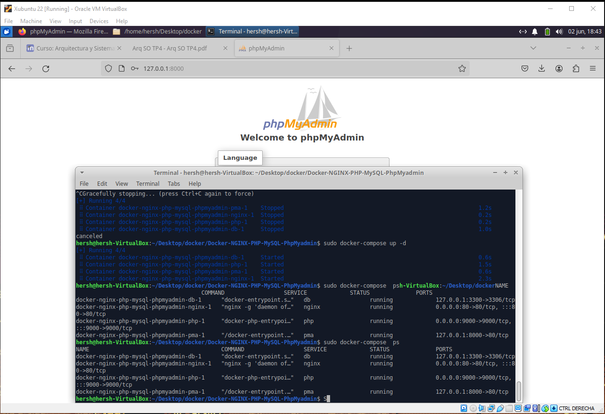
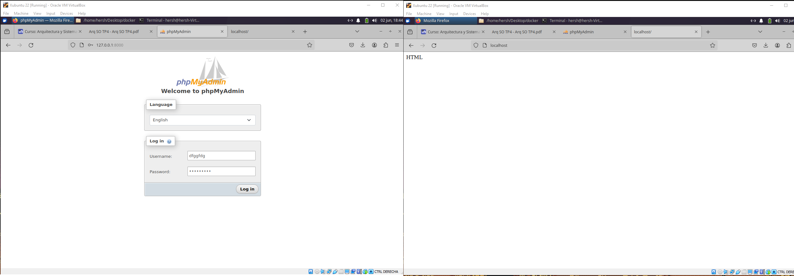
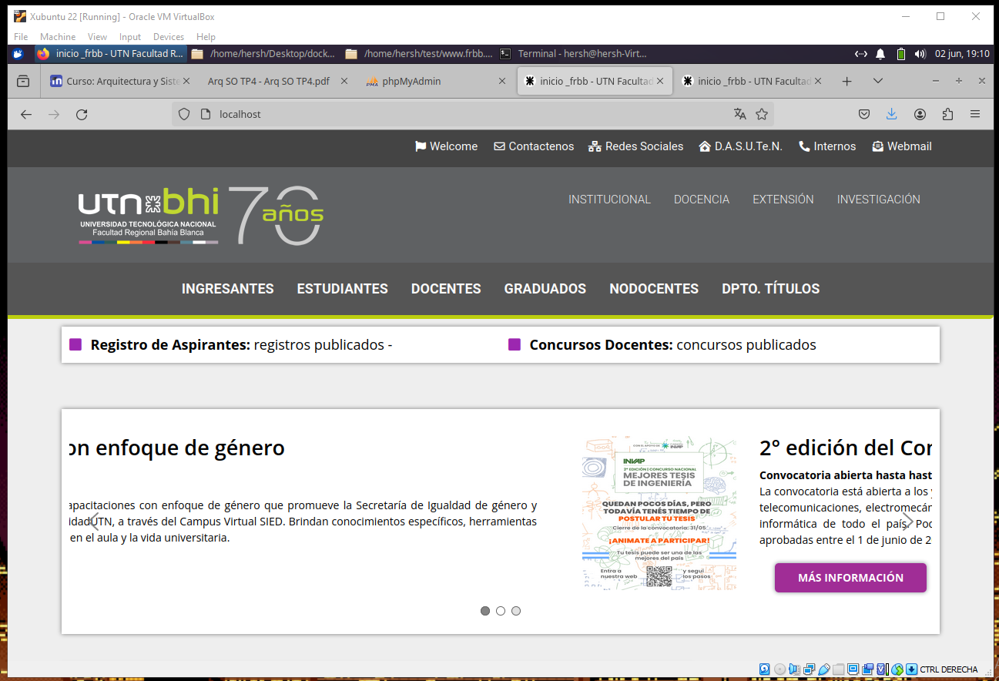

# Practico 2

> Esta es el segundo entregable para la materia Arquitectura de Sistemas Operativos.
 
> Practica de los conceptos basicos de git bash, como clonar un repositorio, realizarle cambios mediante BASH haciendo uso de instucciones como mkdir y/o cd, ls, etc. 

> Tambien se tuvo en cuenta como hacer commits y para que sirven, el metodo push para subir cambios al repositorio en github y por ultimo se vio como controlar los procesos que estan ejecucion en segundo plano.

# Practico 3

1) 

> a) El tiempo de ejecucion en el archivo "sinhilos" es mayor que el del archivo "conhilos"
> Ademas, en el primer archivo las tareas se ejecutan una por una mientras que en el archivo "conhilos" empieza las tres tareas por igual.

> b) Si son iguales

> c) El valor final cambio y el tiempo de ejecucion fue mayor porque esta haciendo dos ciclos for innecesarios

# Practico 4

> Aca estoy creando los servicios y luego mostrandolos en consola.

> Servicio phpmyadmin(http://localhost:8000/) y nginx(http://localhost/).

> Sitio de la facultad UTN FRBB corriendo de forma local.

